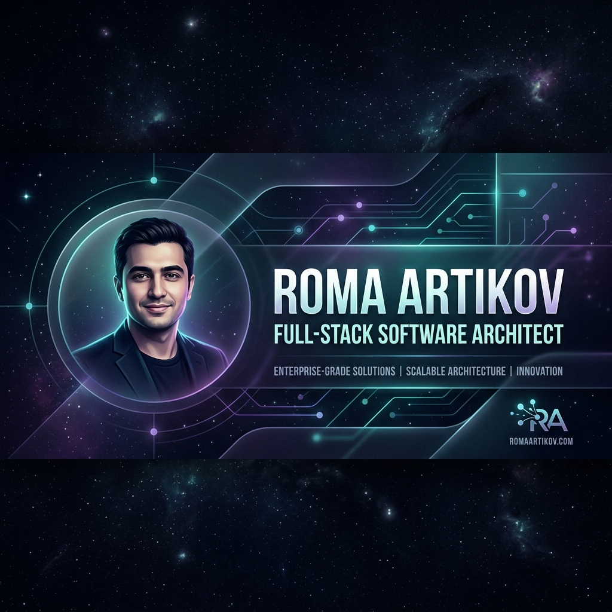

# 🚀 Roma Artikov - Senior Full-Stack Engineer Portfolio

Welcome to the repository of my personal portfolio and interactive digital resume. This project is engineered from the ground up to showcase my skills in building high-performance, secure, and visually stunning web applications.



> **Note:** This project serves as my personal portfolio. It is designed not just to display information, but to demonstrate complex architectural concepts, real-time communication, and advanced UI/UX engineering.

## ✨ Core Features

This portfolio goes beyond a static HTML page. It includes enterprise-grade features:

- 🧊 **3D WebGL Hero Section:** An interactive, floating geometric core built with `Three.js` (`@react-three/fiber`) that reacts to mouse movements.
- 👨‍💻 **Hidden Hacker Terminal:** Press `` ` `` or `~` anywhere on the site to drop down a custom-built Linux-style terminal. Execute commands like `whoami`, `projects`, and `skills` directly in the browser!
- 💬 **Two-Way Real-Time Live Chat:** A fully functional, session-based customer support chat widget using **Socket.io**. Visitors can chat with me in real-time, and I can reply instantly from a secured Admin Dashboard.
- 🌍 **Deep i18n Localization:** The entire UI is strictly localized in English, Uzbek, and Russian. Zero hardcoded strings. State managed seamlessly via Context API.
- 🔐 **Secure Admin Dashboard:** A hidden, protected admin panel (`/aadminsecrect`) with full CRUD operations for managing projects, reading contact messages, and replying to live chats.
- 🚀 **Dynamic SEO & Open Graph:** Fully optimized for social sharing with dynamic meta tags via `react-helmet-async` and custom Open Graph banners.

## 🛠️ Tech Stack

### Frontend
- **Framework:** React 19 + TypeScript (Vite)
- **Styling:** Tailwind CSS v4 + Framer Motion (for smooth micro-animations)
- **3D Graphics:** Three.js, React Three Fiber, React Three Drei
- **State Management:** React Context API & Custom Hooks
- **Icons:** Lucide React & Custom SVGs

### Backend
- **Runtime:** Node.js
- **Framework:** Express.js
- **Database:** PostgreSQL (with `pg` module)
- **Real-Time:** Socket.io
- **Security:** Helmet, CORS, Rate Limiting (express-rate-limit)

---

## 💻 Local Development Setup

To run this project locally on your machine, follow these steps:

### 1. Clone the repository
```bash
git clone https://github.com/Artikov-dev/my-porfio.git
cd my-porfio
```

### 2. Setup the Backend
Navigate to the backend directory and install dependencies:
```bash
cd backend
npm install
```
Create a `.env` file in the `backend` folder and configure your PostgreSQL database:
```env
PORT=5000
DB_USER=postgres
DB_PASSWORD=your_password
DB_HOST=localhost
DB_PORT=5432
DB_NAME=portfolio_db
CORS_ORIGIN=http://localhost:5173
```
Run the backend server:
```bash
npm run dev
```

### 3. Setup the Frontend
Open a new terminal, navigate to the frontend directory, and install dependencies:
```bash
cd frontend
npm install
```
Run the development server:
```bash
npm run dev
```

The frontend will be available at `http://localhost:5173` and the backend API at `http://localhost:5000`.

---

## 📬 Contact & Connect

If you're interested in discussing system architecture, clean code, or potential collaborations:

- **LinkedIn:** [Roma Artikov](https://www.linkedin.com/in/artikovdev/)
- **Telegram:** [@artikov_06_tt](https://t.me/artikov_06_tt)
- **Email:** artikovrozik52@gmail.com
- **Instagram:** [@artikovv_r](https://instagram.com/artikovv_r)

*Engineered with precision and art.* ☕
